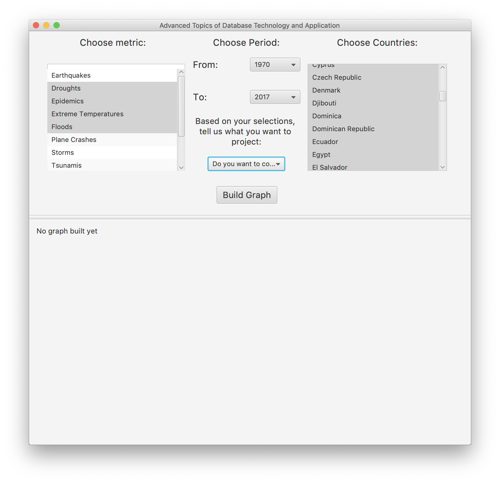
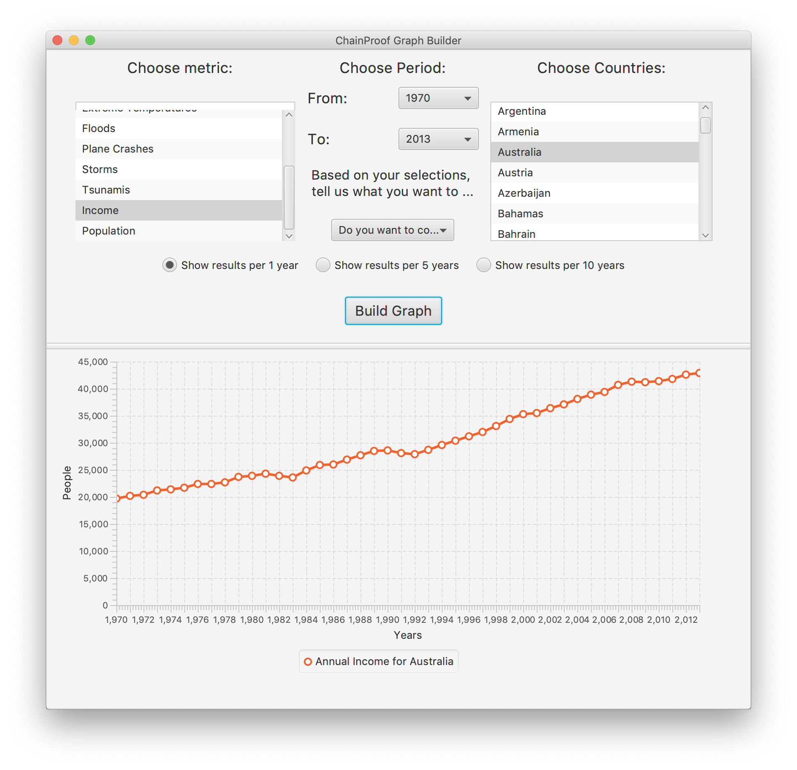
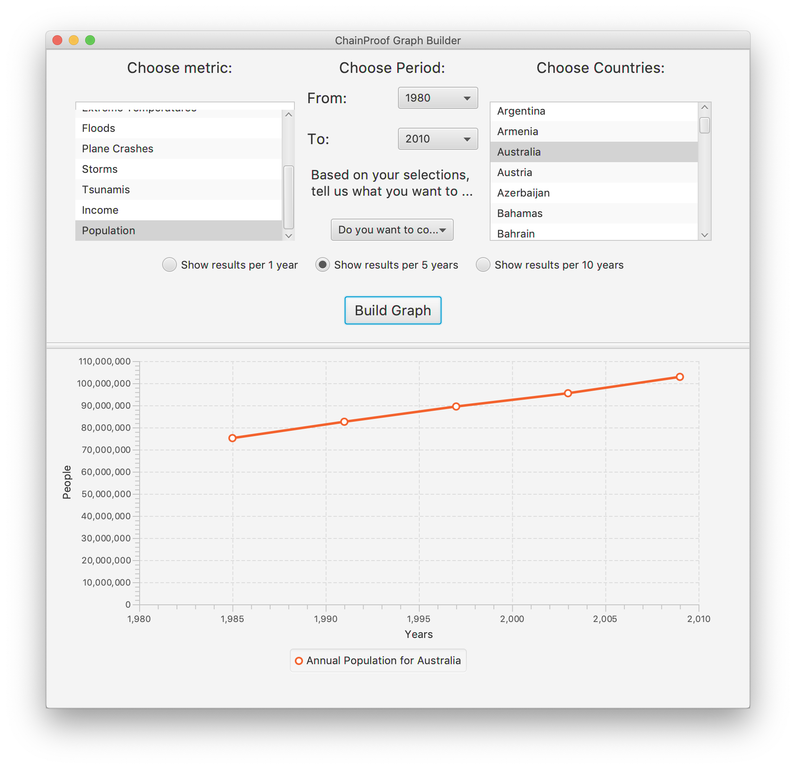

### Advanced Topics of Database Technology and Applications
#### Semester Project
##### Introduction
The purpose of this project is to familiarize with the creation of a fully-fledged system. The system will include a data ETL Pipeline, a MySQL database for data storage and retrieval as well as a GUI for user interaction.

We download data from [Gapminder](https://www.gapminder.org/data/) regarding natural disasters that occurred around the globe to various countries and years. The downloaded data are in a csv format, which we then feed through our ETL pipeline where we extract each line and do some transformations to bring them at our desired state. Then we create new and transformed files, which are inserted to our MySQL database through the  ***LOAD INFILE*** command.

We created a backend system that allows our GUI to request data from the database and plot various charts, based on the user's filters.

##### Stack
The project was developed with Java for the backend and ETL scripts, as well as JavaFX for the GUI. These tools are not ideal for this use case. A javascript framework like react or vuejs along with nodejs and d3js would have yield better results but we decided to go with our overlapping skill set and, also, had little to zero time to spare so Java and JavaFX it is.

##### Description
We have some scripts written in Java than enable us to input .csv files transform them and output .txt files that are ready for ingestion by our MySQL database. Then we constructed a Java backend that allow us to query the database and fetch data for each destruction, and plot the desired charts for the filters that the user entered in our GUI.

